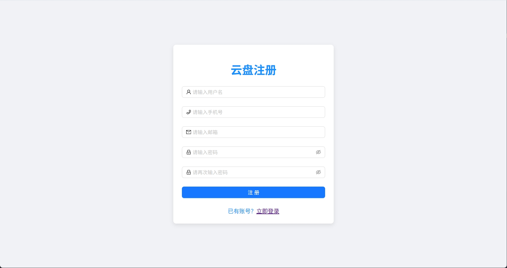
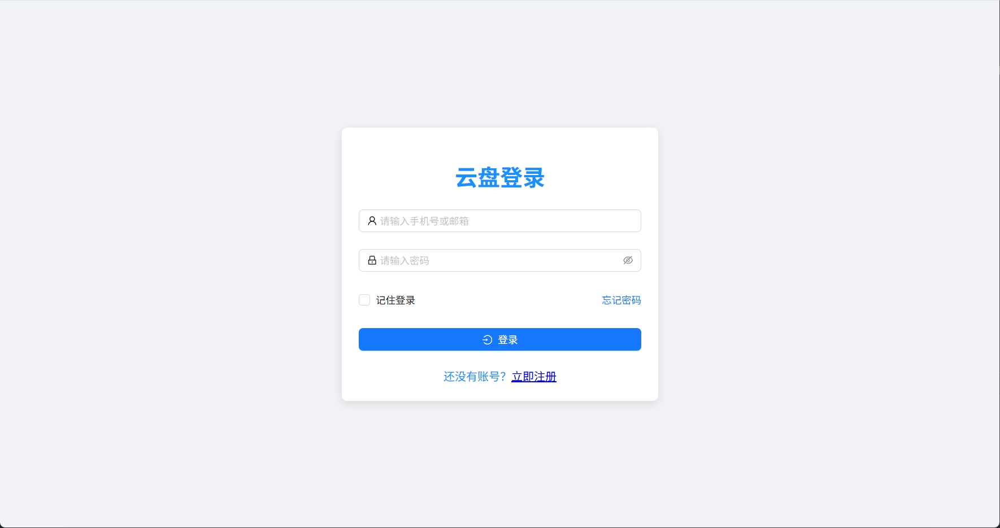
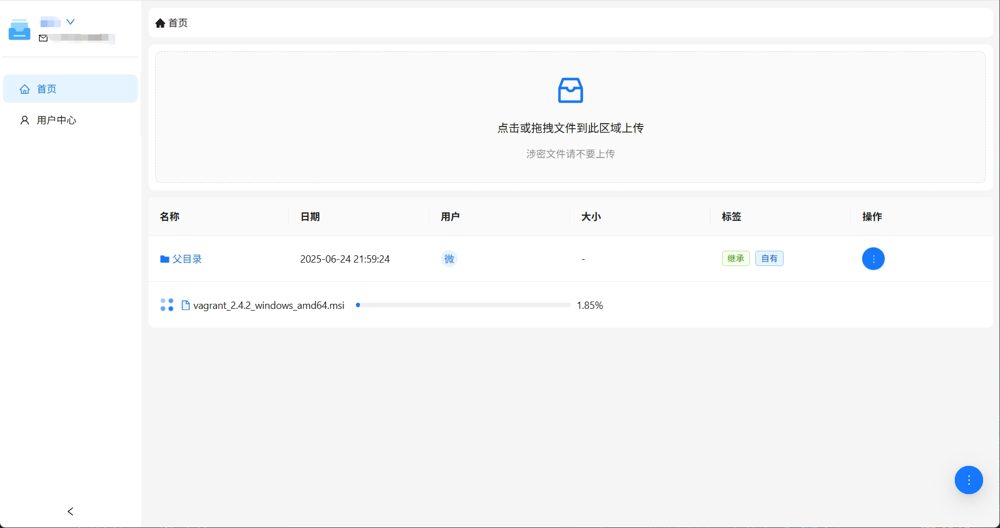
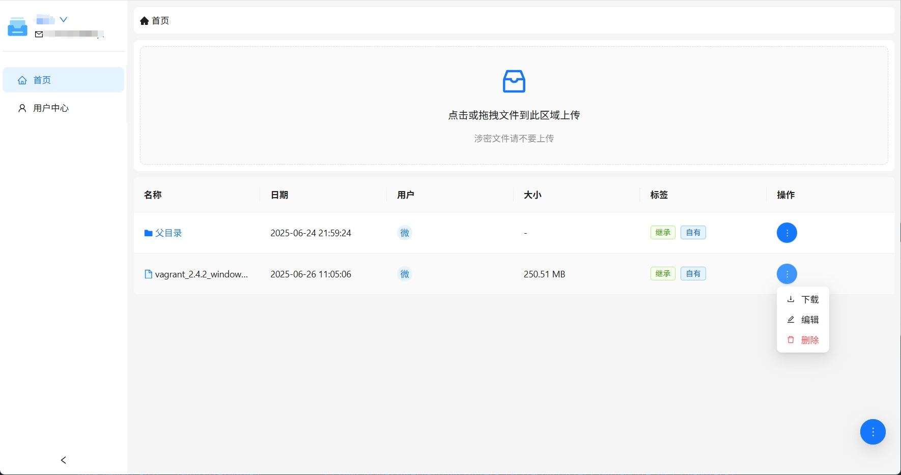
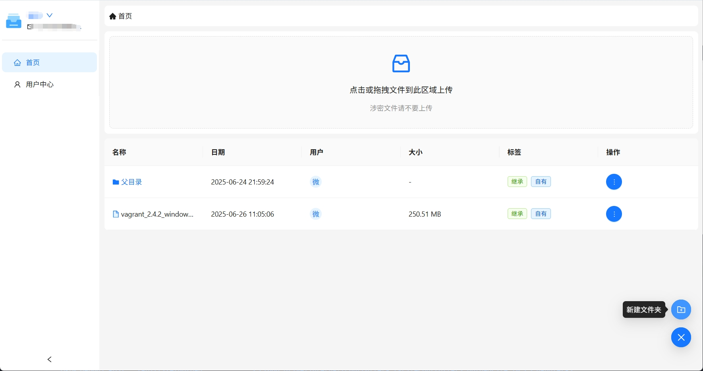
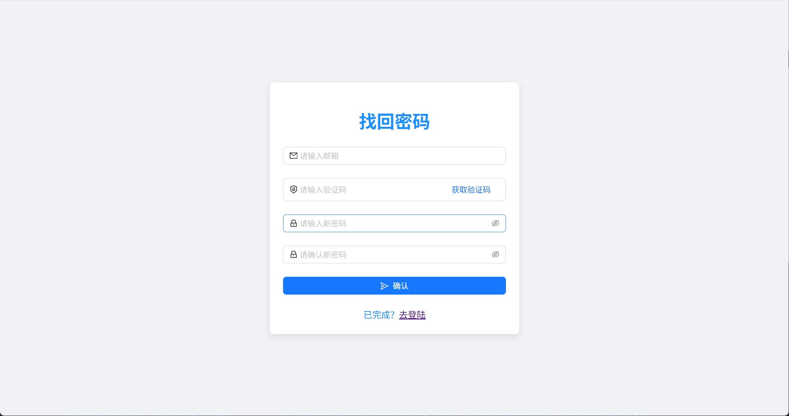

## 共享云盘

一款部署在内网服务器上的文件共享网盘，可以实现内部文件共享。

### 部署
1. 在[Release](https://github.com/wesmile2020/cloud-drive/releases)页直接下载对应平台的二进制文件
2. 打开终端启动应用程序

### 功能
- 账号注册

- 账号登录

- 文件上传

- 文件操作
下载/删除/重命名

- 创建文件夹

- 找回密码

### 配置
启动服务后会在当前目录下生成一个config/config.yaml文件

`log.level` 日志等级，可选值为`debug`,`info`,`warn`,`error`默认值为info。

`server.port` 服务端口，默认值为8080。

`server.mode` 服务运行模式，可选值为`release`,`debug`默认值为release。

`database.dsn` 数据库连接字符串，此为sqlite数据库db文件名

##### email 配置
用于找回密码功能，需要配置邮箱smtp服务器地址、端口、账号、密码。
目前仅支持qq邮箱

`email.host` 邮箱smtp服务器地址

`email.port` 邮箱smtp服务器端口

`email.username` 邮箱账号

`email.password` 邮箱SMTP/IMAP 授权码

### 权限
1. 只有登录的用户才可以创建文件夹和上传文件
2. 文件和文件夹有三种权限设置
    - 公开：所有人都可以查看
    - 继承：继承父文件夹权限
    - 私有：只有自己可以查看
